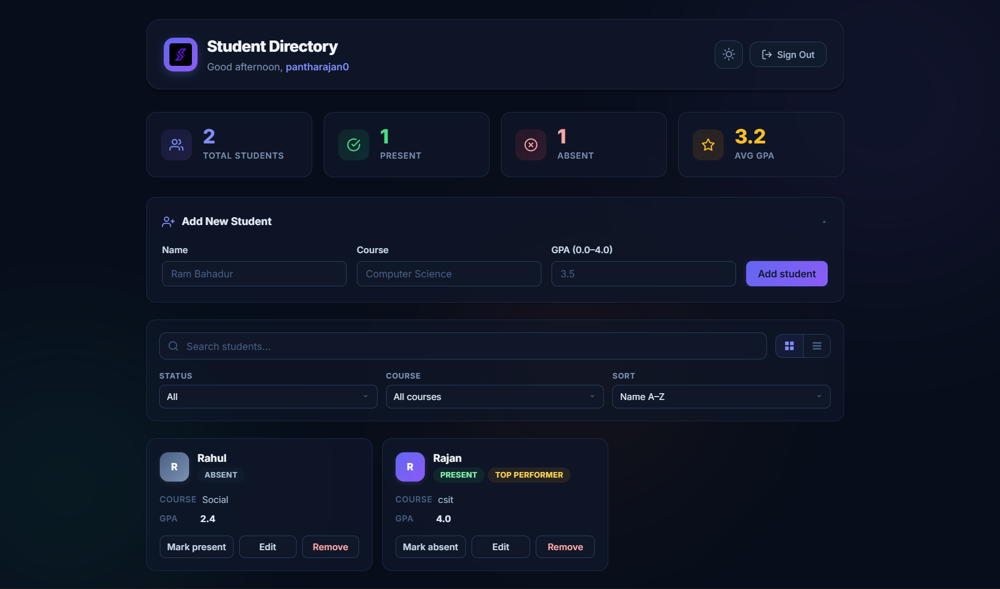

# Student Directory

A modern, full-stack React application for managing students in a classroom. Features Supabase-powered authentication, real-time CRUD operations with cloud persistence, and a polished UI with dark/light theming.



## Getting Started

### Prerequisites

- [Node.js](https://nodejs.org/) (v18+)
- A [Supabase](https://supabase.com/) project with a `students` table

### Setup

1. **Clone the repository**

   ```bash
   git clone https://github.com/rajanpanth/Assignment-5.git
   cd react-student-management
   ```

2. **Install dependencies**

   ```bash
   npm install
   ```

3. **Configure environment variables**

   Create a `.env` file in the project root:

   ```env
   VITE_SUPABASE_URL=https://your-project.supabase.co
   VITE_SUPABASE_ANON_KEY=your-anon-key
   ```

4. **Start the dev server**

   ```bash
   npm run dev
   ```

   Opens at [http://localhost:5173](http://localhost:5173).

## Features

### Authentication
- Email/password sign-up and sign-in via Supabase Auth
- Protected routes — unauthenticated users are redirected to the sign-in page
- Personalized greeting based on time of day (morning / afternoon / evening)
- Sign-out functionality

### Student Management
- **Add** students with name, course, and GPA (with form validation)
- **Edit** students inline — click Edit on any card to modify details
- **Delete** students with a single click
- **Toggle attendance** — mark students as present or absent
- All data is stored per-user in Supabase (cloud-persisted)

### Search, Filter & Sort
- Real-time search by student name
- Filter by attendance status (Present / Absent)
- Filter by course (dynamically populated from your data)
- Sort by Name (A–Z / Z–A) or GPA (High–Low / Low–High)
- Active filter chips with individual clear buttons

### UI / UX
- **Dark / Light mode** toggle (preference saved to localStorage)
- **Grid and List view** toggle for the student directory
- Collapsible "Add Student" form section
- Summary stats dashboard (Total, Present, Absent, Avg GPA)
- "Top Performer" badge for students with GPA ≥ 3.6
- Empty states for no students and no search results
- Staggered card entrance animations
- Modern Inter font, glassmorphism effects, and animated background orbs

## Tech Stack

| Layer         | Technology                          |
|---------------|-------------------------------------|
| Framework     | React 19                            |
| Build Tool    | Vite 7                              |
| Routing       | React Router v7                     |
| Backend/Auth  | Supabase (Auth + PostgreSQL)        |
| Styling       | Plain CSS (no UI libraries)         |
| Hosting       | Firebase Hosting                    |
| Font          | Inter (Google Fonts)                |

## Project Structure

```
react-student-management/
├── index.html                  # HTML entry with meta tags & font imports
├── package.json
├── vite.config.js
├── .env.example                # Template for environment variables
└── src/
    ├── main.jsx                # App entry — routing & providers
    ├── index.css               # CSS reset
    ├── styles.css              # All styles (light + dark themes)
    ├── lib/
    │   └── supabase.js         # Supabase client initialization
    ├── context/
    │   └── AuthContext.jsx      # Auth provider (sign in/up/out, session listener)
    ├── pages/
    │   ├── SignIn.jsx           # Sign-in page with branded split layout
    │   ├── SignUp.jsx           # Sign-up page with branded split layout
    │   └── Dashboard.jsx        # Main dashboard — stats, form, toolbar, student grid
    └── components/
        ├── ProtectedRoute.jsx   # Route guard — redirects if not authenticated
        ├── StudentCard.jsx      # Student card with inline editing
        ├── AddStudentForm.jsx   # Form for adding new students
        ├── Badge.jsx            # Status & achievement badge
        ├── Button.jsx           # Reusable button (primary, outline, danger)
        └── Input.jsx            # Labeled input with validation support
```

## Deployment

The app is configured for Firebase Hosting. To deploy:

```bash
npm run build
firebase deploy
```

## Supabase Schema

The app expects a `students` table with the following columns:

| Column       | Type      | Notes                          |
|--------------|-----------|--------------------------------|
| `id`         | uuid      | Primary key (auto-generated)   |
| `user_id`    | uuid      | References `auth.users.id`     |
| `name`       | text      | Student name                   |
| `course`     | text      | Course name                    |
| `grade`      | numeric   | GPA (0–4 scale)                |
| `is_present` | boolean   | Attendance status              |
| `created_at` | timestamp | Auto-generated timestamp       |

Row Level Security (RLS) should be enabled so each user can only access their own students.

## License

This project is for educational purposes (Assignment 5).
